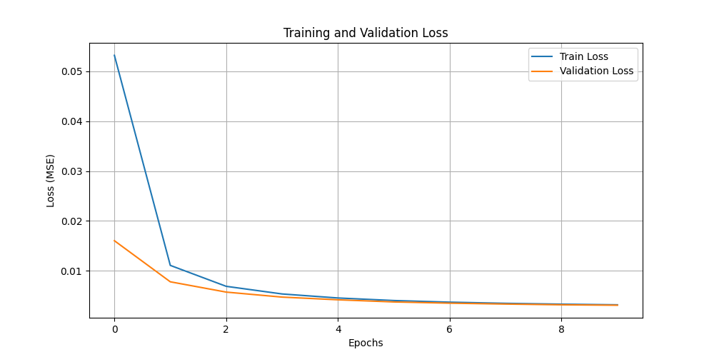
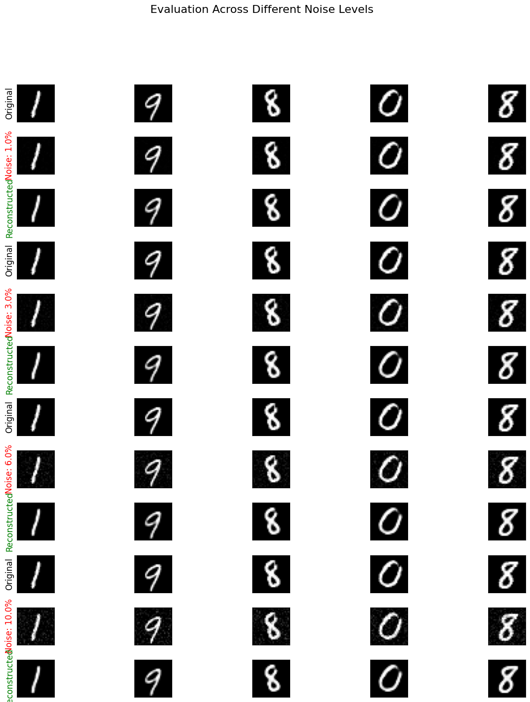

# Denoising Autoencoder for MNIST Grayscale Filters

This repository implements a Convolutional Denoising Autoencoder, architected strictly following the `AI_EXPERT_COURSE` guidelines, built to process corrupted MNIST images and reconstruct their original clean states.

## 🧠 The Core Idea

A **Denoising Autoencoder** is a neural network trained to ignore "noise" or corruptions in data. The architecture structurally bottlenecks the input data into a dense, lower-dimensional representation (the Latent Space) before decoding it back to its original dimensions. 
Because the bottleneck is too small to memorize random statistical noise, but large enough to retain structural features, the network is forces to learn the _true_ underlying distribution of the data. 
In our approach, we deliberately corrupt MNIST digit images with Gaussian noise (at levels varying from 0.01% up to 10%) and use the network to reconstruct the clean image using Mean Squared Error (MSE) loss against the uncorrupted variant.

## 📂 Project Structure

```text
L43-Homework/
│
├── assets/
│   ├── evaluation_noise_levels.png   # Inference results grid
│   └── training_curve.png            # Loss metrics curve over 10 epochs
│
├── data/                             # MNIST dataset (Auto-downloaded via torchvision)
├── models/                           # Saved weights (.pth files)
│   └── denoising_autoencoder.pth
│
├── config.py                         # Centralized configuration & hyperparameters
├── datasets.py                       # Data loading and dynamic NoiseInjection pipeline
├── evaluate.py                       # Post-training variable noise stress testing
├── interactive_noise.ipynb           # Jupyter Widget Slider for noise demonstration
├── main.py                           # Orchestration logic
├── model.py                          # PyTorch Conv2D Autoencoder Class Definition
├── requirements.txt                  # Python dependencies
├── train.py                          # Training loop and plotting metrics
└── README.md                         # This comprehensive document
```

## 🏗️ Data Flow / Architecture

Our Autoencoder features a highly symmetrical convolutional design to capture spatial hierarchies seamlessly. 

1. **Input**: A corrupted image Tensor of shape `[Batch, 1, 28, 28]`.
2. **Encoder**: 
   - Uses `Conv2d` blocks with `kernel_size=3, stride=2` to progressively downsample the spatial resolution while increasing depth channels from 1 -> 16 -> 32 -> 64.
   - The final encoded Latent Representation is shape `[Batch, 64, 1, 1]`.
3. **Decoder**:
   - Mirrors the Encoder using `ConvTranspose2d` layers.
   - Upsamples the `[1,1]` tensor back through `[7,7]` -> `[14,14]` -> `[28,28]`.
   - Uses a `Sigmoid()` activation constraint at the very end to guarantee the output values bound perfectly between `[0.0, 1.0]`, matching the original image constraints.

## 📊 Results

### Training Loss
The Denoising Autoencoder converged quickly across 10 epochs, proving the network rapidly learned to interpolate and ignore the random Gaussian static applied.



### Variable Noise Inferences
Below are the reconstructed outputs of the network when exposed to varying degrees of data corruption during testing: `1%`, `3%`, `6%`, and `10%` noise.



## 🔍 Honest Assessment

**What Worked Excellently:**
- The network mastered discarding low levels of noise (`1%` and `3%`). It smoothly identified the continuous shapes of the digits through the static. 
- The convolutional blocks provided immediate geometric spatial awareness, making the structural integrity of the number very sharp.

**What Underperformed & Why:**
- At the extreme `10%` noise injection level, the network's constraints begin to show. A noise level this high on standard unscaled pixel intensities causes severe blurring where the digit edges meet the static background. The Reconstruction mechanism (via Mean Squared Error) tends to naturally generate somewhat "blurry" interpretations because it acts as a statistical mean estimator over the possible variations. At extreme static interference, the MSE loss minimizes effectively by smudging the edges aggressively rather than predicting sharp lines.

## 🚀 What Needs to Be Done (Next Steps)

| Identified Issue | Proposed Solution |
| :--- | :--- |
| **Blurry Reconstructions at 10% Noise** | Switch the loss function from plain `MSELoss` to `SSIM (Structural Similarity Index Measure)`. SSIM focuses heavily on perceived human structural sharpness rather than mathematically safe pixel averaging. |
| **Difficulty Recognizing Edge Contrast** | Incorporate a `BCEWithLogitsLoss` combined with the MSE, or add a mild Perceptual Loss component (using a frozen pre-trained network) to penalize blurriness explicitly. |
| **Model Size Constraints** | Test deeper Residual Blocks (`ResNet` style) to allow greater feature retention without expanding grid dimensionality prematurely. |

## 🛠️ Setup & Usage

To spin up this project effectively on your local machine, navigate to the `L43-Homework` directory and execute the following:

**1. Create a Python Virtual Environment**
- *Windows:* `python -m venv venv && venv\Scripts\activate`
- *Linux/macOS:* `python3 -m venv venv && source venv/bin/activate`

**2. Install Dependencies**
```bash
pip install -r requirements.txt
```

**3. Run the Interactive Noise Slider (Requirement #3)**
```bash
jupyter notebook interactive_noise.ipynb
```

**4. Execute the Training and Evaluation Pipeline**
```bash
python main.py
```
*(Model weights will be saved to `models/` automatically, and inference plots will appear in `assets/`)*

## 💿 Dataset Attribution
This project relies on the classic [MNIST Database of Handwritten Digits](http://yann.lecun.com/exdb/mnist/) cultivated by Yann LeCun, Corinna Cortes, and Christopher J.C. Burges. The dataset is fetched dynamically during pipeline initialization via `torchvision.datasets.MNIST`.
